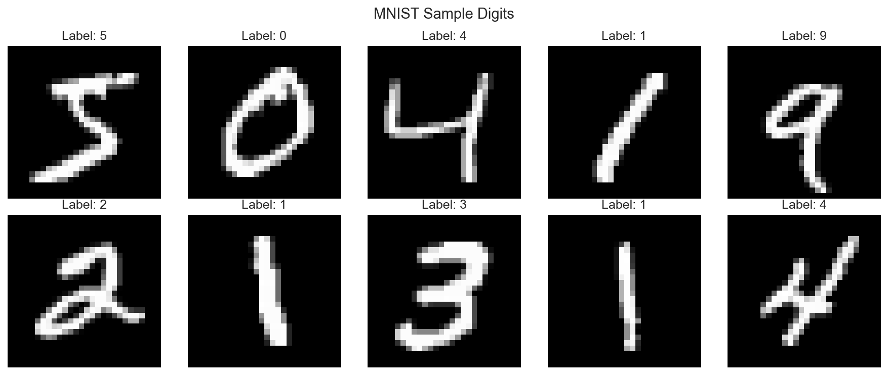
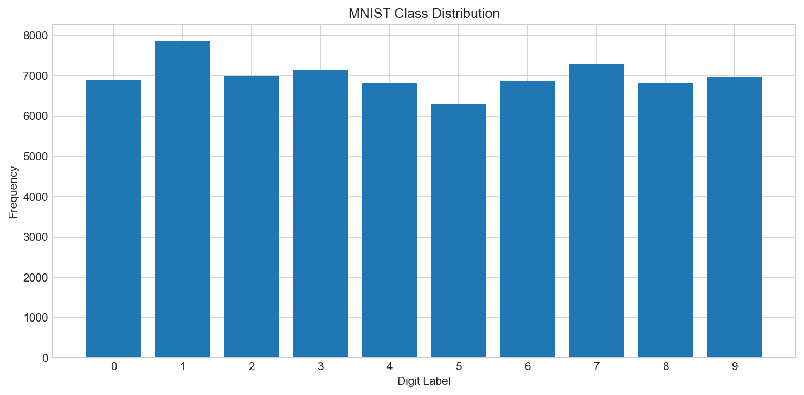
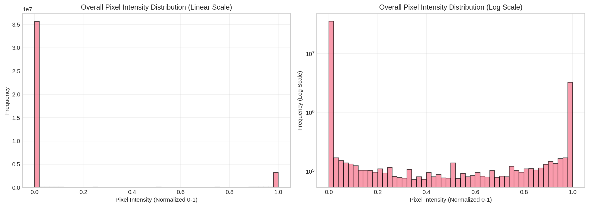
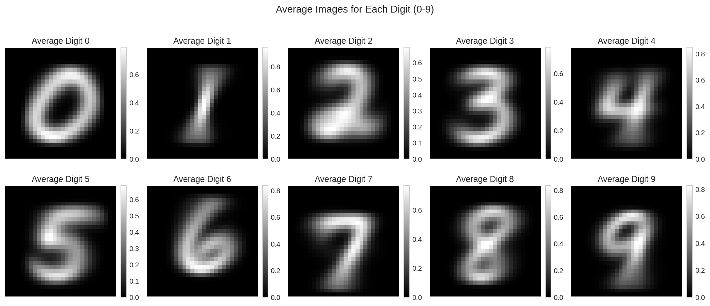
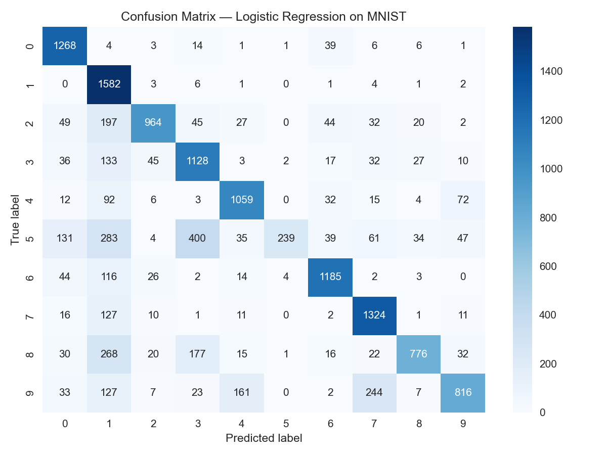
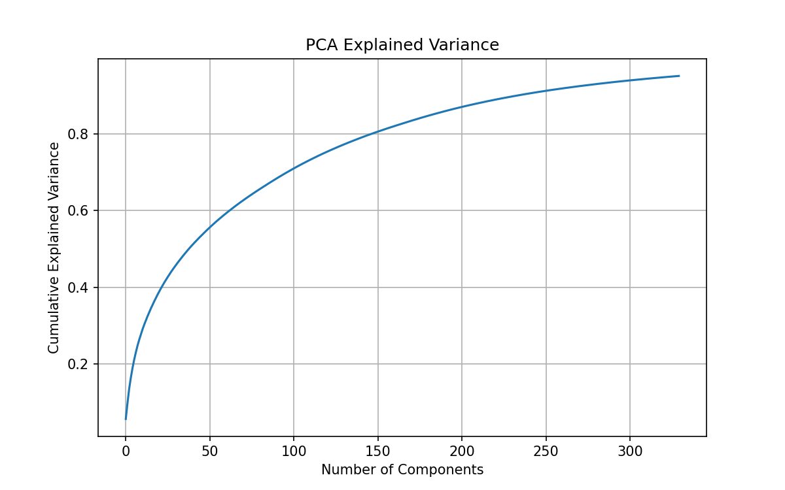

# MNIST Statistical Digit Classification

A full statistical + machine learning analysis pipeline on the MNIST handwritten digit dataset, implemented as a notebook-driven project.

This repository covers:
- dataset acquisition and validation,
- preprocessing and train/test preparation,
- exploratory statistical analysis of pixel distributions,
- multinomial logistic regression modeling,
- repeated sampling and confidence-interval analysis,
- PCA-based dimensionality reduction and post-PCA classification.

---

## Project Goals

1. Build a reproducible pipeline from raw MNIST data to trained models.
2. Analyze MNIST as a statistical dataset (pixel distributions, moments, per-digit behavior).
3. Train and evaluate a baseline classifier (multinomial logistic regression).
4. Quantify performance variability with repeated random sampling and inferential statistics.
5. Compare baseline modeling with PCA-reduced features.

---

## Repository Structure

```text
mnist-statistical-digit-classification/
├── data/
│   ├── raw/                  # Raw MNIST arrays (X.npy, y.npy)
│   └── processed/            # Train/test and PCA-transformed arrays
├── notebooks/                # Main workflow notebooks (Task 1 → Task 6)
├── images/                   # Generated plots and visual outputs
├── models/                   # Trained model artifacts (.pkl)
├── results/                  # Metrics, summaries, and Task 5 sampling plots
├── final notebook/           # Existing folder name in repo (contains demo file)
├── requirements.txt          # Python dependencies
└── LICENSE                   # MIT license
```

---

## Notebook Workflow (Task-wise)

Run notebooks in order for full reproducibility:

1. **`01_dataset_loading.ipynb`**
   - Downloads MNIST via `sklearn.datasets.fetch_openml`.
   - Performs initial validation and inspection.
   - Saves raw arrays to:
     - `data/raw/X.npy`
     - `data/raw/y.npy`
   - Generates initial visualizations:
     - `images/sample_digits.png`
     - `images/class_distribution.png`

2. **`02_data_preprocessing.ipynb`**
   - Normalizes pixel values to `[0, 1]`.
   - Performs train/test split (`test_size=0.2`, `random_state=42`).
   - Saves processed arrays:
     - `data/processed/X_train.npy`
     - `data/processed/X_test.npy`
     - `data/processed/y_train.npy`
     - `data/processed/y_test.npy`

3. **`03_distribution_analysis.ipynb`**
   - Treats pixels as random variables.
   - Computes descriptive statistics and per-digit intensity behavior.
   - Analyzes specific pixel locations and average digit templates.
   - Exports:
     - `results/statistical_summary.csv`
   - Generates:
     - `images/pixel_distribution.png`
     - `images/digit_pixel_distributions.png`
     - `images/mean_intensity_by_digit.png`
     - `images/pixel_location_distributions.png`
     - `images/average_digits.png`

4. **`04_Logestic_regression.ipynb` (Task 4: Logistic Regression)**
   - Flattens image tensors for linear modeling.
   - Trains multinomial logistic regression (`lbfgs`, `max_iter=1000`).
   - Evaluates with accuracy, balanced accuracy, macro/weighted precision-recall-F1, log loss, top-3 accuracy.
   - Exports:
     - `models/logistic_model.pkl`
     - `results/model_accuracy.txt`
   - Generates:
     - `images/correlation_heatmap.png`
     - `images/confusion_matrix.png`
     - `images/logistic_coefficients.png`

5. **`05_sampling_analysis.ipynb`**
   - Runs repeated random sampling experiments (`runs=30`, `sample_size=10000`).
   - Trains logistic regression per run and tracks accuracy variation.
   - Computes confidence interval and performs Shapiro-Wilk normality test.
   - Exports:
     - `models/best_sampling_model.pkl`
     - `results/task5_sampling_results.csv`
     - `results/task5_sampling_summary.csv`
   - Generates:
     - `results/task5_accuracy_distribution.png`
     - `results/task5_clt_demonstration.png`

6. **`06_pca_analysis.ipynb`**
   - Standardizes data (`StandardScaler`) and applies PCA (`n_components=0.95`).
   - Saves reduced features:
     - `data/processed/X_train_pca.npy`
     - `data/processed/X_test_pca.npy`
   - Trains logistic regression on PCA features.
   - Exports:
     - `models/pca_model.pkl`
     - `results/pca_model_accuracy.txt`
   - Generates:
     - `images/explained_variance.png`

---

## Key Results

### Baseline Logistic Regression (`results/model_accuracy.txt`)

- Accuracy: **0.738643**
- Balanced Accuracy: **0.730038**
- Precision (macro): **0.792720**
- Recall (macro): **0.730038**
- F1 (macro): **0.719739**
- Top-3 Accuracy: **0.936357**
- Log Loss: **1.677253**

### PCA + Logistic Regression (`results/pca_model_accuracy.txt`)

- Accuracy after PCA: **0.9219**

### Sampling-Based Stability Analysis (`results/task5_sampling_summary.csv`)

- Mean Accuracy: **0.9005**
- Variance: **3.986206896551727e-05**
- Std Dev: **0.006313641498019765**
- 95% CI: **[0.8982406924059354, 0.9027593075940645]**
- Shapiro-Wilk p-value: **0.3053435313165992**

---

## Example Visual Outputs

### Class and Sample Visualization



### Statistical and Model Diagnostics





---

## Setup

### 1) Clone the repository
```bash
git clone https://github.com/vivek-i8/mnist-statistical-digit-classification.git
cd mnist-statistical-digit-classification
```

### 2) Create and activate a virtual environment
```bash
python -m venv .venv
source .venv/bin/activate   # Linux / macOS
```

On Windows (PowerShell):
```powershell
.venv\Scripts\Activate.ps1
```

### 3) Install dependencies
```bash
pip install --upgrade pip
pip install -r requirements.txt
```

### 4) Launch Jupyter
```bash
jupyter notebook
```

Then execute notebooks in `notebooks/` sequentially from Task 1 to Task 6.

---

## Reproducibility Notes

- Raw and processed `.npy` files are already included, so analysis can be run from intermediate stages.
- Notebook outputs and saved artifacts in `images/`, `models/`, and `results/` reflect prior completed runs.
- For reproducible split behavior in preprocessing, Task 2 uses `random_state=42`.
- Sampling analysis intentionally varies split seeds across runs (`random_state=i`) to estimate variability.

---

## Dependencies

From `requirements.txt`:
- `numpy>=1.21.0`
- `pandas>=1.3.0`
- `scikit-learn>=1.0.0`
- `matplotlib>=3.4.0`
- `seaborn>=0.11.0`

---

## License

This project is licensed under the **MIT License**. See [`LICENSE`](LICENSE).
